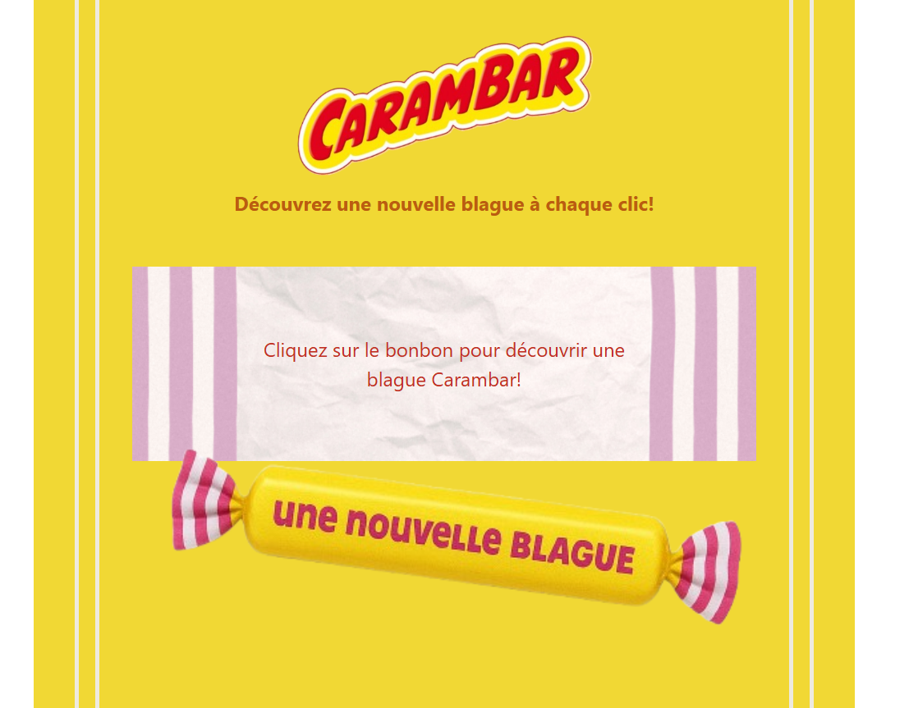

# API de blagues Carambar - Backend

## Présentation du projet
Ce projet est une API RESTful générant des blagues de façon aléatoire, développée avec Node.js, Express, TypeScript et Sequelize. Il constitue un exercice de démonstration pour ma candidature à l'école d'informatique Simplon.

## Technologies utilisées
- **Runtime:** Node.js
- **Framework:** Express.js
- **Langage:** TypeScript
- **ORM:** Sequelize
- **Base de données:** SQLite
- **Documentation:** Swagger/OpenAPI
- **Déploiement:** via render.com 

## Fonctionnalités
- Endpoints RESTful pour la récupération de blagues
- Fonction de blague aléatoire
- Structure de données optimisée et évolutive
- Documentation API complète via Swagger
- Système de seeding pour initialiser la base de données
- Gestion des erreurs et validation des données

## Installation et démarrage
### Cloner le repository
`git clone https://github.com/CHSPN/carambar-api.git`
`cd carambar-api`

### Installer le projet
`npm install`

### Compiler le TypeScript
`npm run build`

### Démarrer le serveur
`npm start`

### Alternative: mode développement avec rechargement automatique
`npm run dev`

## Documentation API
La documentation complète de l'API est disponible via Swagger UI une fois le serveur démarré:
**URL de Swagger:** http://localhost:3000/api-docs

## Endpoints
- **GET /api/v1/jokes** - Récupérer toutes les blagues
- **GET /api/v1/jokes/:id** - Récupérer une blague spécifique par ID
- **GET /api/v1/jokes/random** - Récupérer une blague aléatoire
- **POST /api/v1/jokes** - Créer une blague

## Structure du projet côté backend
carambar-api/
├── src/
│   ├── config/        # Configuration (base de données, env)
│   ├── controllers/   # Contrôleurs HTTP
│   ├── models/        # Définitions des modèles Sequelize
│   ├── routes/        # Définitions des routes API
│   ├── seeds/         # Données initiales
│   ├── app.ts         # Configuration de l'application Express
│   └── server.ts      # Point d'entrée de l'application
├── dist/              # Code TypeScript compilé
├── tsconfig.json      # Configuration TypeScript
├── package.json       # Dépendances et scripts
└── README.md          # Documentation du projet

## Choix techniques et architecturaux
- **TypeScript:** Utilisé pour garantir la robustesse du code et faciliter la maintenance
- **Architecture MVC:** Organisation claire des responsabilités
- **API RESTful:** Respect des conventions HTTP et structuration logique des routes
- **ORM Sequelize:** Abstraction de la base de données pour une meilleure portabilité
- **Documentation Swagger:** Documentation interactive pour faciliter la compréhension et les tests

## Liens
- **Application de blagues Carambar:** 
- **Repository GitHub de la partie Backend:** https://github.com/CHSPN/carambar-api
- **Repository Github de la partie Frontend:** https://github.com/CHSPN/carambar-front
- **Documentation API:** 

## Auteur
Charlène SCOMPARIN